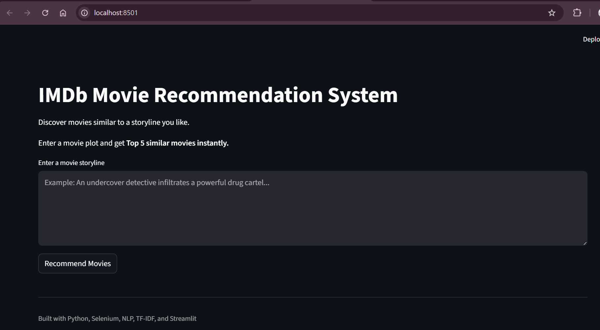
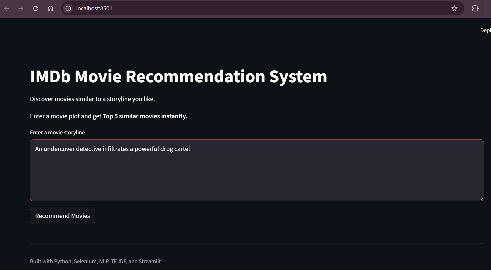
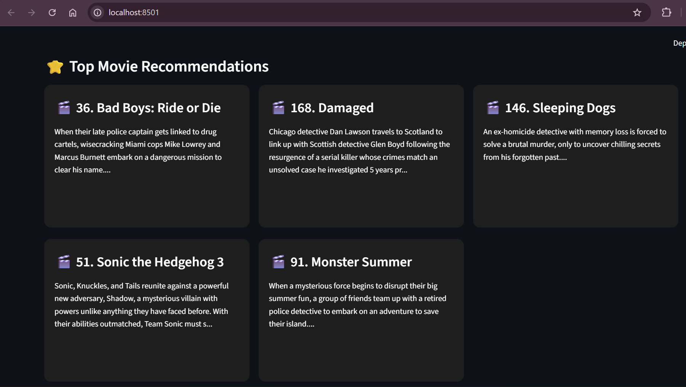

# IMDb Movie Recommendation System using Streamlit

## Project Overview

This project is a Movie Recommendation System built using Python and Streamlit.  
The system recommends movies based on the similarity of their **storylines**.

The recommendation engine analyzes movie plots using **Natural Language Processing (NLP)** techniques and suggests movies with similar storylines.

The project includes **web scraping, text preprocessing, machine learning, and an interactive Streamlit application**.

---

## Objective

The objective of this project is to:

- Scrape movie data from IMDb.
- Extract movie titles and storylines.
- Clean and preprocess textual data using NLP techniques.
- Convert text into numerical features using TF-IDF.
- Use similarity-based ranking for recommendations.
- Deploy an interactive Streamlit application for users.

---

## Dataset Description

The dataset was created by scraping IMDb movie listings for 2024.

The dataset contains the following features:

| Column | Description |
|------|-------------|
| Movie Name | Title of the movie |
| Storyline | Short plot summary of the movie |

### Feature Types

- **Textual:** Storyline  
- **Categorical:** Movie Name

Generated files:

- `imdb_2024_movies.csv`
- `imdb_2024_movies_processed.csv`

---

## Data Collection

Movie data was collected from **IMDb** using Selenium.

The scraper automatically:

- Navigates IMDb movie listings
- Loads additional movies using pagination
- Extracts movie titles
- Extracts movie storyline summaries

The scraped data is saved into:
- `data/imdb_2024_movies.csv`


---

## Data Cleaning & Preprocessing

The movie storylines were processed using NLP techniques to prepare the data for machine learning.

The preprocessing steps include:

- Convert text to lowercase
- Remove punctuation
- Remove digits
- Tokenization
- Remove English stopwords
- Apply stemming using PorterStemmer

The cleaned storylines are stored in a new column called **Processed_Storyline**.

Generated file:
- `data/imdb_2024_movies_processed.csv`

---

## Recommendation Methodology

The recommendation system follows these steps:

1. Load the processed movie dataset.
2. Convert processed storylines into numerical vectors using **TF-IDF Vectorization**.
3. Create a feature matrix representing all movie storylines.
4. Accept user input storyline from the Streamlit interface.
5. Preprocess the input storyline using the same NLP pipeline.
6. Transform the input text using the trained TF-IDF vectorizer.
7. Compute similarity between the input storyline and all movie storylines using **Cosine Similarity**.
8. Rank movies based on similarity scores.
9. Display the **Top 5 recommended movies**.

This ensures recommendations are based on storyline similarity.

---

## Streamlit Application

The project includes an interactive **Streamlit web interface**.

Users can:

- Enter a movie storyline or plot description
- Click the **Recommend Movies** button
- View the **Top 5 similar movies**

The application dynamically computes recommendations using the trained similarity model.

---

## Application Preview

### Home Page



### User Input



### Recommendation Results



---

## Technologies Used

- Python
- Selenium
- Pandas
- NLTK
- Scikit-learn
- Streamlit
- Git & GitHub

---

## How to Run the Project

### Clone the Repository

```bash
git clone https://github.com/ArvindhMM/movie-recommendation-system.git
cd movie-recommendation-system
```

### Install Dependencies

```bash
pip install -r requirements.txt
```

### Run Streamlit App

```bash
streamlit run app/streamlit_app.py
```

## Project Structure
``` bash
movie-recommendation-system/
│
├── app/
│   └── streamlit_app.py
│
├── data/
│   ├── imdb_2024_movies.csv
│   └── imdb_2024_movies_processed.csv
│
├── src/
│   ├── scraper.py
│   ├── preprocess.py
│   ├── preprocess_data.py
│   └── recommender.py
│
├── requirements.txt
└── README.md
```

## Business Use Cases

- Personalized movie discovery
- Content-based recommendation systems
- Entertainment recommendation platforms
- Story-based movie suggestions
- Media analytics and user engagement

## Challenges & Optimization

- IMDb pagination required handling dynamic content loading.
- Selenium automation had to manage dynamic page elements.
- Storyline text required extensive cleaning and normalization.
- TF-IDF dimensionality was optimized using feature limits.
- Efficient preprocessing ensured the system runs smoothly on limited hardware.

## Project Outcomes

- Successfully built a content-based movie recommendation system.
- Implemented automated IMDb data scraping.
- Applied NLP techniques for text preprocessing.
- Built a similarity-based recommendation engine using TF-IDF and Cosine Similarity.
- Developed an interactive Streamlit application for user interaction.